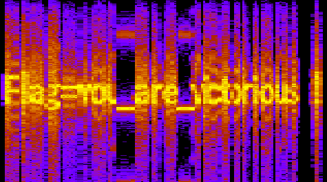

# Lesson 19: Audio Forensics

> Lesson Link:\
> *[https://cybertalents.com/learn/introduction-to-cybersecurity/lessons/19-audio-forensics-1](https://cybertalents.com/learn/introduction-to-cybersecurity/lessons/19-audio-forensics-1)*

## Introduction

Audio forensics is the process of recovering and analyzing audio data from digital devices. It is a branch of digital forensics that deals with the recovery and investigation of material found in audio devices, often in relation to computer crime. Audio forensics can be used in the investigation of cybercrime, computer crime, or high-tech crime.

## Challenge

> Name:\
> *I love music*

---

> Description:\
> *listen and focus , you will listen another thing*\
> Flag format : XXX_XXX_XXXXXXXXXXX

## Solution

In this challenge we are given an audio file called `love-music-wav`, and we need to find the flag in it.

We can use [academo](https://academo.org/demos/spectrum-analyzer/) to open the audio file, and then we can use the spectrogram view to see the audio file as a graph.

It will look something like this:

We can see that the flag is `you_are_victorious`.

## Flag

> you_are_victorious

## References

- [https://en.wikipedia.org/wiki/Audio_forensics](https://en.wikipedia.org/wiki/Audio_forensics)
