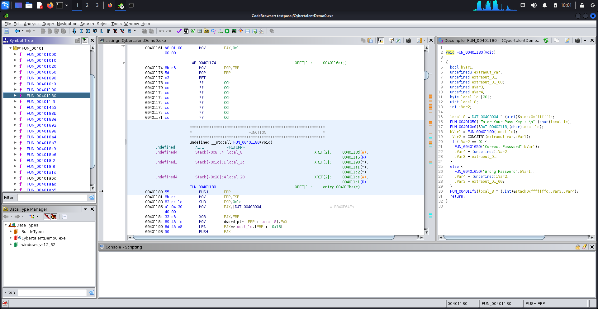
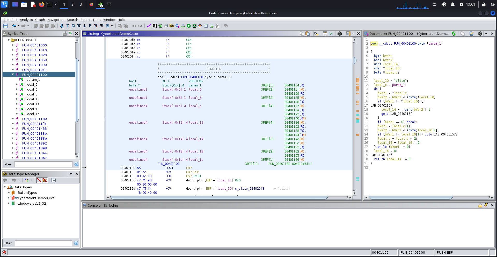
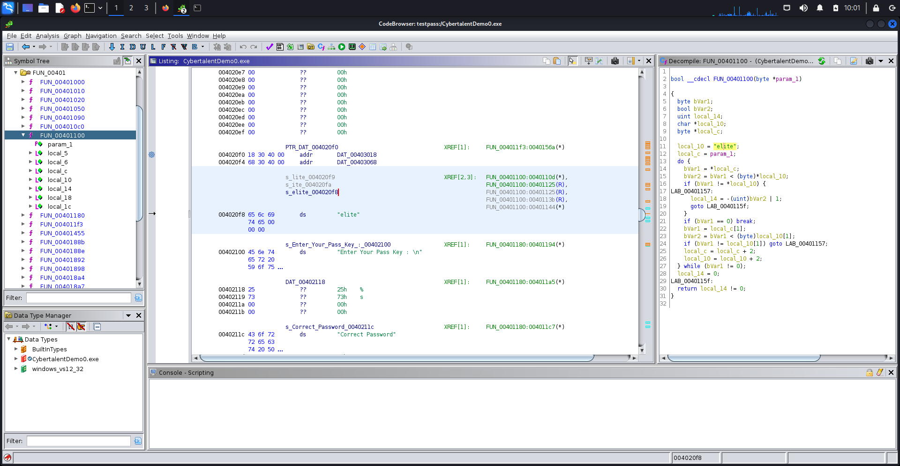

# Lesson 23: Introduction to Reverse Engineering

> Lesson Link:\
> *[https://cybertalents.com/learn/introduction-to-cybersecurity/lessons/23-introduction-to-reverse-engineering](https://cybertalents.com/learn/introduction-to-cybersecurity/lessons/23-introduction-to-reverse-engineering)*

## Introduction

In this lesson, we will learn about reverse engineering. We will start by learning about the different types of reverse engineering. Then we will learn about the tools used in reverse engineering.

## Challenge

> Name:\
> *Find the Pass*

---

> Description:\
> *This Challenge will help you understand reverse engineering basics and understand code flow from assembly instructions.*\
> *Answer the following questions :*\
> *Q1- What is the address of the main function?*\
> *Q2- What is the address of the function that Validates the input?*\
> *Q3- What is the address of the hardcoded password?*\
> *Flag format : flag{Ans1|Ans2|Ans3}*

## Solution

In this challenge, we are given a .exe file.

we can use `file` to check the file type:

```bash
file CybertalentDemo0.exe
```

We get the following output:

```bash
CybertalentDemo0.exe: cannot open 'CybertalentDemo0.exe' (No such file or directory)
```

So We Need to use a tool to analyze the file. I went with `ghidra`.

After opening the file in `ghidra`, we will find all the functions in the file in left side of the window.

after stpping through the code, we will find the following function `FUN_00401180` which is main function.



after stepping through the code, we will find the following function `FUN_00401100` which is the function that validates the input.



after stepping through the code, we will find the following function `s_elite_004020f8` which is the hardcoded password.



No let's construct the flag, first we need to convert the addresses to hex.

```bash
FUN_00401180 = 0x401180
FUN_00401100 = 0x401100
s_elite_004020f8 = 0x4020f8
```

Now we can construct the flag.```

## Flag

> flag{0x401180|0x401100|0x4020f8}

## References

- [ghidra](https://ghidra-sre.org/)
